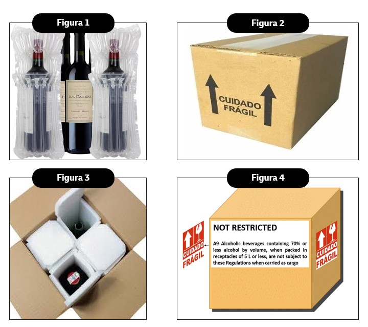

# Transporte de Bebidas Alcoólicas

## Regras Gerais

- **Bebidas alcoólicas contendo 24% ou menos de álcool por volume**  
  ➡️ Não são classificadas como materiais perigosos e **não possuem restrições** de transporte.

- **Bebidas alcoólicas acima de 24% e até 70% de álcool por volume**  
  ➡️ Também não são consideradas mercadorias perigosas, **desde que atendam às condições da Provisão Especial A9**.

---

## Provisão Especial A9

De acordo com a IATA:

> **A9 Alcoholic beverages containing 70% or less alcohol by volume, when packed in receptacles of 5 L or less, are not subject to these Regulations when carried as cargo.**

### Requisitos:
- Embalagens de **varejo fechadas** (⚠️ bebidas artesanais não são permitidas);
- Máximo de **5 L por embalagem interna**;
- A remessa deve seguir em **embalagem apropriada**, sem nenhuma marca de artigo perigoso;
- As palavras **"Not Restricted"** e a referência à **Provisão Especial A9** devem constar:
  - **Na declaração de produto não perigoso** (campo “Contents” do WB);  
  - **Na caixa externa**, junto à provisão A9.

---

## Requisitos de Embalagem

Todas as garrafas devem estar protegidas de forma a evitar danos durante o transporte:

1. **Plástico bolha** em cada garrafa (Figura 1).  
2. **Caixa colmeia** para evitar atrito e movimentação (Figura 2).  
3. **Marcação FRÁGIL** + **etiquetas de setas** em **dois lados opostos** da caixa externa (Figura 3).  
   - Se estiver sob a **Provisão A9**, a informação deve constar também na caixa externa.

📷 **Exemplo de preparação**:  
  

---

## ⚠️ Nota Importante

🚫 **Bebidas artesanais são proibidas para transporte.**

---
