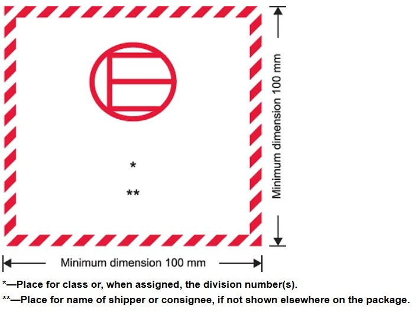

# Cargas Perigosas em Quantidades Isentas (Excepted Quantities - EQ)

Determinadas substâncias perigosas podem ser transportadas em **pequenas quantidades** sob o regime de **Excepted Quantities (EQ)**.  
Nesses casos, as exigências regulatórias são simplificadas, mas ainda há **limites técnicos, embalagens e marcações obrigatórias**.

---

## O que pode ser transportado em EQ

- **Classe 2.2** (gases não inflamáveis e não tóxicos, com algumas exceções)  
- **Classe 3** (líquidos inflamáveis, exceto alguns PG I)  
- **Classe 4** (sólidos inflamáveis PG II e III, exceto auto-reativos)  
- **Classe 5.1 e 5.2** (oxidantes PG II/III e kits de resina/poliéster)  
- **Classe 6.1** (substâncias tóxicas, exceto PG I inalatórios)  
- **Classe 8** (corrosivos PG II/III, com algumas exclusões)  
- **Classe 9** (substâncias diversas, exceto artigos específicos)  

⚠️ **Artigos (objetos)** não são aceitos em EQ — apenas substâncias.

---

## Limites por Código EQ

A coluna F da Lista de Artigos Perigosos (IATA 4.2) define os códigos EQ:  

| Código | Máx. por embalagem interna | Máx. por embalagem externa |
|--------|-----------------------------|-----------------------------|
| **E0** | Não permitido em EQ         | –                           |
| **E1** | 30 g / 30 mL                | 1 kg / 1 L                  |
| **E2** | 30 g / 30 mL                | 500 g / 500 mL              |
| **E3** | 30 g / 30 mL                | 300 g / 300 mL              |
| **E4** | 1 g / 1 mL                  | 500 g / 500 mL              |
| **E5** | 1 g / 1 mL                  | 300 g / 300 mL              |

---

## Regras de Embalagem

- É **obrigatória a embalagem tripla**:  
  1. **Embalagem interna**: vidro, metal ou plástico ≥ 0.2 mm, bem lacrado.  
  2. **Embalagem intermediária**: material absorvente + proteção contra impacto.  
  3. **Embalagem externa**: rígida e resistente (caixa de madeira, papelão forte, etc.).  

- O pacote deve resistir a **queda de 1,8 m** em 5 posições diferentes, sem quebrar ou vazar.  
- Deve resistir a empilhamento equivalente a 3 m de altura por 24h.  

---

## Marcação obrigatória

Todo pacote em EQ deve conter a etiqueta padrão:  

📌 **Figura – Exemplo de marcação EQ:**  

- Quadrado preto/vermelho em fundo branco (100 mm × 100 mm).  
- Indicar a **classe/divisão** do produto dentro do quadrado.  
- Se não estiver em outro lugar da embalagem, incluir o **nome do remetente/destinatário**.  

> **Overpacks:** devem conter a palavra **“OVERPACK”** e repetir as marcações EQ, exceto se já visíveis.

---

## Documentação

- **Shipper’s Declaration NÃO é exigido** para EQ.  
- Na emissão **WB** deve constar a frase:  
  **“Dangerous Goods in Excepted Quantities”**  
  + o número de pacotes (quando aplicável).  

---

## Restrições

- Não pode ser combinado com artigos DG que exijam **Shipper’s Declaration**.  
- Se for transportado com **gelo seco (UN1845)**, aplicar também a **PI954**.
- Conta e rota precisam estar aprovadas.

---

## Nota Importante – BRG-06

Para voos com origem ou destino Brasil, embalagens EQ **só são aceitas** se acompanhadas de **laudo/teste da embalagem** conforme IATA.  
Esse documento deve comprovar os ensaios exigidos (queda, empilhamento, resistência etc.) e ter **validade máxima de 3 anos**.

---
