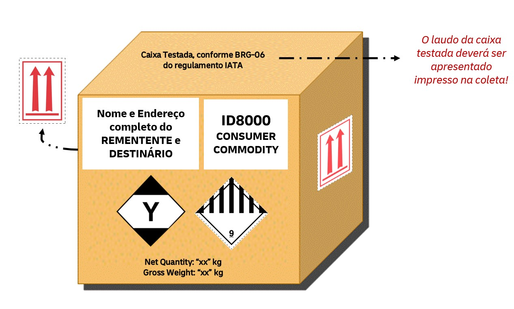

# Transporte de Perfumes

## Classificação

A maioria dos perfumes contém **álcool** e, portanto, são potencialmente inflamáveis.  
Por isso, são classificados como **Mercadorias Perigosas** e seguem regulamentos rígidos da **IATA**.

- Classificação IATA: **UN1266 – Produtos de perfumaria com solventes inflamáveis**  
- Alternativamente, podem ser enviados sob a designação de **Consumer Commodity – ID8000 (Quantidade Limitada)** 

---

## Requisitos para envio pela DHL Express

- **A conta (Shipper Account) precisa estar aprovada** para envio de perfumes.  
- É necessário verificar se a **rota está habilitada** para este tipo de carga.  
- Clientes **CASH** (sem contrato/ sem conta) **não podem transportar DG** conosco, conforme o política interna.  

---

## Embalagem, Etiquetagem e Declaração

### Perfumes em Quantidade Limitada (ID 8000)

- Embalagem deve ser **testada e aprovada**, conforme **BRG-06 da IATA** e instrução de embalagem **Y963**;  
- É permitido enviar até **500 ml por embalagem interna** e até **30 kg por embalagem externa**;  
- A embalagem externa deve conter:  
  - Nome de embarque apropriado: **Consumer Commodity**  
  - **ID 8000** (atenção para as letras “ID”)  
  - **Etiqueta de Diversos (Classe 9)**  
  - **Marca de quantidade limitada (IATA 7.1A)**  
  - **Etiquetas de seta de posição** em **dois lados opostos** da caixa  
- Além da aprovação da conta, a rota também precisa estar liberada.  
- Para aprovação de conta, o cliente deverá apresentar **certificado válido de transporte aéreo de DG Categoria 1 ou CBTA equivalente**.  
- É obrigatório o preenchimento e apresentação de **3 cópias em inglês da Shipper’s Declaration**, a cores e com o tracejado vermelho.  
  - ⚠️ **A DHL não preenche a declaração** — é responsabilidade do cliente.

---

## Exemplo de Preparação

Abaixo, um exemplo visual de como deve estar a embalagem externa para perfumes:  

  

---

## Importante

- Perfumes **não podem ser enviados sem aprovação de conta e rota**.  
- Documentação incorreta ou embalagem inadequada resultará em **recusa da remessa**.  

---

## 📑 Nota Regulatória – BRG-06

Para voos envolvendo o **Brasil como Estado de Origem ou Destino**:

- **Mercadorias perigosas em quantidades limitadas** somente podem ser transportadas em embalagens que atendam às disposições aplicáveis da seção **2.7**.  
- **Mercadorias perigosas em quantidades isentas** somente podem ser transportadas em embalagens que atendam às disposições aplicáveis da seção **2.6**.  
- **Substâncias biológicas, Categoria B (UN 3373)** somente podem ser transportadas em embalagens que atendam às disposições aplicáveis da **Instrução de Embalagem 650**.  
- Um **documento comprobatório** (ex.: relatório de teste, certificado ou outro documento equivalente) deve **acompanhar a remessa**, demonstrando que os testes/qualificações exigidos foram realizados.  
- O prazo de validade desse documento não pode exceder **3 anos**.

---
